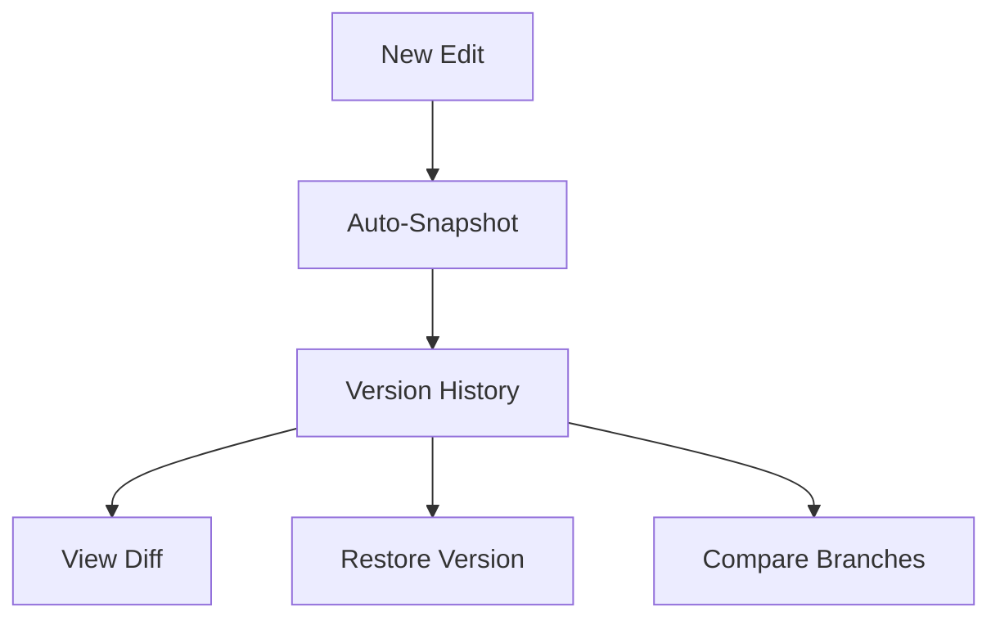

## Overview

Angga provides powerful tools to organize, collaborate on, and maintain your project documentation. You can structure documents hierarchically, share with teams securely, search efficiently using tags, and track changes over time. These features streamline your workflow from initial setup to ongoing maintenance.

<Columns cols={2}>
  <Card title="Document Structuring" icon="folder" href="#document-structuring">
    Organize content with folders and nesting.
  </Card>
  <Card title="Collaboration" icon="users" href="#collaboration">
    Share and work together in real-time.
  </Card>
  <Card title="Search & Tagging" icon="search" href="#search-tagging">
    Find documents quickly with smart search.
  </Card>
  <Card title="Version History" icon="git-branch" href="#version-history">
    Track and revert changes easily.
  </Card>
</Columns>

## Document Structuring and Folders

Create a clear hierarchy for your documentation using folders and subfolders. You nest documents up to five levels deep, making large projects manageable.

<Steps>
  <Step title="Create a Folder" icon="folder-plus">
    Navigate to your workspace root and select **New Folder**. Name it descriptively, like `api-reference`.
  </Step>
  <Step title="Add Documents" icon="file-plus">
    Inside the folder, create new Markdown files or upload existing ones.
  </Step>
  <Step title="Nest Subfolders" icon="folder">
    Repeat to add subfolders, such as `endpoints` under `api-reference`.
  </Step>
</Steps>

Use the REST API for programmatic structuring:

<CodeGroup tabs="JavaScript,cURL">
  ```javascript
  const response = await fetch('https://api.example.com/v1/folders', {
    method: 'POST',
    headers: { 'Authorization': `Bearer ${YOUR_API_KEY}` },
    body: JSON.stringify({
      name: 'api-reference',
      parentId: null
    })
  });
  ```
  ```bash
  curl -X POST https://api.example.com/v1/folders \
    -H "Authorization: Bearer YOUR_API_KEY" \
    -H "Content-Type: application/json" \
    -d '{"name": "api-reference", "parentId": null}'
  ```
</CodeGroup>

## Collaboration and Sharing Options

Invite team members and control access levels. You share individual documents, folders, or entire workspaces publicly or privately.

<Tabs>
  <Tab title="Team Invite" icon="users">
    Generate invite links with roles: **Viewer**, **Editor**, or **Admin**.

    <ParamField path="workspaceId" param-type="string" required="true">
      Your workspace identifier.
    </ParamField>

    <ParamField body="role" param-type="string" required="true">
      Set to `editor` or `viewer`.
    </ParamField>
  </Tab>
  <Tab title="Public Sharing" icon="globe">
    Toggle public access for read-only viewing. Embed links work on external sites.
  </Tab>
  <Tab title="Real-time Edits" icon="edit-3">
    Multiple users edit simultaneously with live cursors and conflict resolution.
  </Tab>
</Tabs>

<Callout kind="tip">
  Always review permissions before sharing sensitive documentation.
</Callout>

## Search and Tagging Systems

Angga's search scans full-text content, metadata, and tags. Add tags like `api`, `internal`, or `deprecated` for precise filtering.

| Feature | Description | Example Tags |
|---------|-------------|--------------|
| Full-Text Search | Matches across titles, body, and code blocks | `authentication flow` |
| Tag Filtering | Click tags to narrow results | `api`, `v2`, `beta` |
| Advanced Filters | Combine by date, author, or folder | `status:active author:john` |

<CodeGroup tabs="API,UI">
  ```javascript
  // Search via API
  const results = await fetch('https://api.example.com/v1/search?q=auth&tags=api,v2');
  ```
  ```markdown
  # In document frontmatter
  tags: [api, authentication, secure]
  ```
</CodeGroup>

## Version History Tracking

Every edit creates a snapshot. You view diffs, restore previous versions, or compare changes.



<Steps>
  <Step title="Access History" icon="clock">
    Open a document and click **History** in the toolbar.
  </Step>
  <Step title="Compare Versions" icon="git-compare">
    Select two snapshots to see side-by-side diffs.
  </Step>
  <Step title="Restore" icon="refresh-cw">
    Click **Restore** on any version to revert.
  </Step>
</Steps>

<Expandable title="Advanced Versioning Tips" default-open="false">

Use branching for major rewrites:

```javascript
// Create a branch via API
await fetch('https://api.example.com/v1/branches', {
  method: 'POST',
  body: JSON.stringify({ documentId: 'doc-123', name: 'rewrite-v2' })
});
```

</Expandable>

<Callout kind="success">
  Start by structuring your first folder to experience these features hands-on.
</Callout>