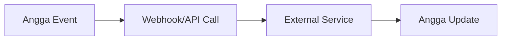

## Overview

Angga supports seamless integrations with popular third-party services. You connect these tools to automate documentation updates, sync content across platforms, and trigger workflows. Use pre-built app connections for quick setup or build custom solutions with the Angga API and webhooks.

<Callout kind="info">
  Review your plan limits for integration quotas in the [Angga dashboard](https://dashboard.example.com).
</Callout>

## Popular Third-Party Integrations

Start with these ready-to-use connections. Each integrates in minutes and handles authentication automatically.

<Columns cols={3}>
  <Card title="Slack" icon="message-circle" href="https://slack.com">
    Send documentation updates and notifications to Slack channels.
  </Card>
  <Card title="GitHub" icon="github" href="https://github.com" target="_blank">
    Sync repos with Angga docs and trigger builds on commits.
  </Card>
  <Card title="Google Workspace" icon="file-text" href="https://workspace.google.com">
    Import/export Google Docs and Sheets directly.
  </Card>
</Columns>

## Custom API Integrations

Build tailored integrations using the Angga REST API at `https://api.example.com/v1`. Authenticate with your API key.

<ParamField header="Authorization" param-type="string" required="true">
  Bearer `{YOUR_API_KEY}`.
</ParamField>

<ParamField query="project_id" param-type="string" required="true">
  Your Angga project identifier.
</ParamField>

Here's how to create a document via API:

<CodeGroup tabs="JavaScript,Python">
  ```javascript
  const response = await fetch('https://api.example.com/v1/documents', {
    method: 'POST',
    headers: {
      'Authorization': 'Bearer YOUR_API_KEY',
      'Content-Type': 'application/json'
    },
    body: JSON.stringify({
      title: 'New Doc',
      content: 'Hello from integration!'
    })
  });
  const doc = await response.json();
  console.log(doc);
  ```
  ```python
  import requests

  headers = {
      'Authorization': 'Bearer YOUR_API_KEY',
      'Content-Type': 'application/json'
  }
  data = {
      'title': 'New Doc',
      'content': 'Hello from integration!'
  }
  response = requests.post(
      'https://api.example.com/v1/documents',
      headers=headers,
      json=data
  )
  doc = response.json()
  print(doc)
  ```
</CodeGroup>

<Response tabs="200">
```json
{
  "id": "doc_abc123",
  "title": "New Doc",
  "status": "created"
}
```
</Response>

## Webhook Configurations

Set up webhooks to receive real-time events from Angga, like document updates.

<Steps>
  <Step title="Create Webhook" icon="plus">
    Navigate to Settings > Webhooks in your Angga dashboard.
    
    Enter your endpoint: `https://your-webhook-url.com/webhook`.
  </Step>
  <Step title="Select Events" icon="zap">
    Choose events like `document.updated` or `project.published`.
  </Step>
  <Step title="Test and Save" icon="check-circle">
    Send a test payload and verify receipt.
  </Step>
</Steps>

Example incoming payload:

````json
{
  "event": "document.updated",
  "data": {
    "id": "doc_abc123",
    "title": "Updated Doc"
  },
  "timestamp": "2024-01-15T10:30:00Z"
}
````

<Callout kind="tip">
  Validate payloads with HMAC signatures using your webhook secret.
</Callout>

## Import and Export with External Tools

Angga supports bulk import/export for smooth migrations.

<Tabs>
  <Tab title="GitHub Import" icon="github">
    <Steps>
      <Step title="Connect Repo">
        Link your GitHub repo in Angga Settings > Imports.
      </Step>
      <Step title="Select Branches">
        Choose `main` or `develop` for sync.
      </Step>
    </Steps>
  </Tab>
  <Tab title="Notion Export" icon="file-text">
    Export Angga pages as Markdown to Notion.
    
````bash
angga export --format=markdown --output=notion-import/
````
  </Tab>
  <Tab title="CSV Bulk Import" icon="database">
    Prepare a CSV with columns: `title`, `content`, `slug`.
    
    Upload via dashboard or API.
  </Tab>
</Tabs>

<Expandable title="Advanced Webhook Security" default-open="false">
  Use IP whitelisting and signature verification:
  
  ```javascript
  const crypto = require('crypto');
  const signature = crypto.createHmac('sha256', WEBHOOK_SECRET)
    .update(payload)
    .digest('hex');
  ```
</Expandable>

## Next Steps

Explore the [Angga API reference](/api) for more endpoints. Test integrations in a sandbox project first.

